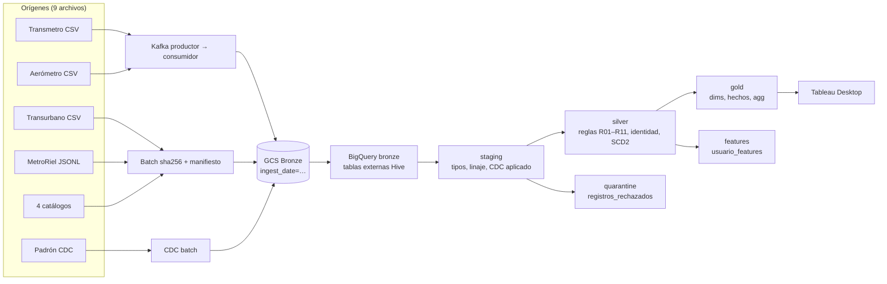

# Agencia Metropolitana de Transporte — Proyecto 1 (URL, Ciencia de Datos)

Pipeline de datos de punta a punta que integra los cuatro operadores de transporte del área metropolitana de
Guatemala (Transmetro, Transurbano, MetroRiel y Aerómetro) bajo una sola definición de viaje y un seudónimo de
persona: Bronze (crudo) → Staging/CDC → Silver (+ cuarentena) → Gold dimensional → Tableau, y Silver → tabla de
features. Todo se despliega con Terraform en GCP, se transforma con dbt y se orquesta con Airflow.

Cifras del lote procesado (45 días, 2026-06-01 a 2026-07-15): **1 730 184 filas de origen = 1 730 184 en Bronze**
(diferencia 0), **11 913 en cuarentena** con motivo (0,688 %), **1 647 569 abordajes** en Gold, **1 093 235 viajes en
junio** por dos caminos independientes, **72,98 %** de las personas usa más de un sistema, **11 de 26 zonas** sin
servicio. Fuente: `docs/METRICAS.md` (solo cifras medidas).

Documentos clave: [plan](docs/PLAN.md) · [avance](docs/PROGRESS.md) · [decisiones (ADR-001…010)](docs/DECISIONS.md) ·
[grano y matriz del bus](docs/modelo/matriz_bus.md) · [métricas](docs/METRICAS.md) ·
[checklist de rúbrica](docs/RUBRICA_CHECKLIST.md) · [guía de defensa](docs/GUIA_DEFENSA.md) ·
[seguridad](docs/governance/seguridad.md).

## Arquitectura

| Capa | Qué contiene | Dónde vive | Cómo se construye |
|---|---|---|---|
| Orígenes | 9 archivos del generador oficial (`docs/generar_red_metropolitana.py`, escala 0,08, ≈ 137 MB) | `datos_red/` (ignorado por git; se regenera y verifica por sha256) | `ingest/generar_o_verificar.py` |
| Bronze | Crudo tal como llegó, particionado por `ingest_date`; 121 objetos, 346 MB | Cloud Storage `gs://cienciadatos-509301-lake/bronze/<fuente>/ingest_date=YYYY-MM-DD/` + 9 tablas externas Hive en BigQuery `bronze` | batch y CDC: `ingest/batch_to_gcs.py`; streaming: `ingest/kafka_producer.py` → Kafka → `ingest/kafka_consumer_gcs.py` |
| Staging | 15 tablas tipadas con linaje; CDC aplicado; catálogos de llaves. Se vacía en cada corrida | BigQuery `staging` | `dbt/models/staging/` |
| Silver + Cuarentena | 9 tablas limpias con identidad unificada, 6 de validación, seeds de gobernanza; rechazos con motivo | BigQuery `silver`, `quarantine` | `dbt/models/silver/`, `dbt/models/quarantine/`, `dbt/seeds/` |
| Gold | 7 dimensiones, 5 hechos, 5 agregados; usuario seudonimizado (HMAC) | BigQuery `gold` | `dbt/models/gold/` |
| Features | `usuario_features` (56 848 personas × 34 columnas) + diccionario | BigQuery `features` | `dbt/models/features/` |
| Ops | Manifiesto de ingesta, métricas de corrida, bloques HMAC | BigQuery `ops`, `ops_secrets` | `ingest/common.py`, `ingest/run_metrics.py`, `ingest/hmac_key_to_bq.py` |
| Streaming | Kafka 4.3 (KRaft, un nodo, sin puertos públicos) | Docker Compose en la VM `vm-pipeline` | `vm/docker-compose.yml` |
| Orquestación | Airflow 3.3.2, LocalExecutor, HTTPS con Caddy; usuarios `admin` y `catedratico` (solo lectura) | Misma VM, `https://airflow.<IP>.sslip.io` | `airflow/dags/red_metropolitana_dag.py` |
| Infraestructura | VPC, firewall, VM, buckets, datasets, IAM, secretos, presupuesto | GCP `cienciadatos-509301`, `us-central1` | Terraform `infra/bootstrap`, `infra/main` |
| Visualización | Tableau Desktop en vivo sobre **Gold únicamente** | `docs/tableau/red_metropolitana_gold.tds` | `docs/tableau/GUIA_TABLERO.md`, `analysis/*.sql` |



Las restricciones duras del diseño (Gold nunca lee Bronze, nada se descarta sin cuarentena, flujo idempotente, cada
cifra rastreable al archivo crudo, features desde Silver, nunca `CURRENT_DATE`, HMAC antes de Gold) están en `CLAUDE.md`
y se verifican con `make test` y `make dbt-test`.

Repositorio: https://github.com/Dsmp28/Proyecto1_CienciaDatos · CI: GitHub Actions (`dbt test` en cada push a `main`).

## Requisitos

- macOS o Linux con `gcloud` (≥ 585), `terraform` (≥ 1.9; probado con 1.15.8), `docker` + `compose` (solo en la VM;
  el script de arranque lo instala), `uv` o Python 3.12, `make`, `git`, `curl`, `jq`.
- Proyecto de GCP con facturación habilitada; el usuario debe ser propietario del proyecto y, para el presupuesto,
  tener `roles/billing.costsManager` en la cuenta de facturación (si no, `create_budget = false`).
- Autenticación sin llaves: `gcloud auth login` y `gcloud auth application-default login`. Nunca llaves JSON.
- Tableau Desktop 2021.1 o posterior (solo para el tablero) con una cuenta de Google que tenga `BigQuery Data Viewer`
  en `gold` y `BigQuery Job User` en el proyecto.
- `gitleaks` para `make scan-secrets` (se instala con Homebrew si falta).

## Instalación desde cero

```bash
# 0. Entorno local (Python 3.12 + dbt-bigquery 1.12.1 + librerías de ingesta)
make venv

# 1. Bootstrap: APIs y bucket de estado de Terraform (estado local, una sola vez)
cp infra/bootstrap/terraform.tfvars.example infra/bootstrap/terraform.tfvars
make bootstrap-plan && make bootstrap-apply          # 14 recursos (13 APIs + bucket <proyecto>-tfstate)

# 2. Main: VPC, firewall (443 público, 22 solo por IAP), VM e2-standard-2, bucket del lake,
#    8 datasets de BigQuery, cuenta de servicio de mínimo privilegio, 4 secretos, presupuesto de 60 USD
cp infra/main/terraform.tfvars.example infra/main/terraform.tfvars   # completar alert_email y billing_account_id
make init && make plan && make apply                 # 49 + 2 recursos (docs/evidence/f0_infraestructura.md)
make outputs                                         # airflow_url, lake_bucket, ssh_command

# 3. Copiar el código a la VM (por túnel IAP, sin datos ni .venv) y levantar la pila
make vm-sync                                         # tar de `git ls-files` → /opt/red-metropolitana
make vm-up                                           # reejecuta vm/startup.sh: Docker, secretos, compose up
make vm-logs                                         # espera a ver los 7 contenedores Up (healthy)

# 4. Perfil de dbt local (OAuth/ADC, sin secretos) y paquetes
# dbt/profiles.yml ya está versionado (OAuth/ADC, sin secretos); dbt/profiles.yml.example es la plantilla si cambia el proyecto
make dbt-deps

# 5. Correr el flujo completo dos veces y comparar conteos (rúbrica 1.5)
make demo-idempotencia                               # informe en docs/evidence/idempotencia_<ts>.md
```

Credenciales de Airflow: `gcloud secrets versions access latest --secret=airflow-admin-password --project cienciadatos-509301`
(y `airflow-viewer-password` para el usuario `catedratico`, rol Viewer). La URL sale de `make outputs`
(`https://airflow.<IP_VM>.sslip.io` en el despliegue actual).

## Cómo correr el flujo

**Desde la UI de Airflow.** Entrar a la URL, abrir el DAG `red_metropolitana`, pestaña *Docs* (explica cada etapa y por
qué es idempotente) y pulsar *Trigger*. Parámetros opcionales: `escala` (vacío = escala oficial 0,08) e `idle_segundos`
(30). Las 18 tareas corren en este orden: `generar_o_verificar_datos` → `ingesta_bronze` (batch, CDC y Kafka productor →
consumidor en paralelo) → `tablas_externas_bronze` → `conciliar_bronze` → `transformacion_dbt` (deps, seed, staging,
silver + quarantine, gold, features, docs) → `pruebas_python` → `registrar_metricas`; `registrar_fallo` se dispara si
cualquier tarea falla. Reintentos: 2 con espera exponencial desde 2 min. Duración por tarea en `ops.run_metrics`.

**Desde la API REST v2.** Es lo que hace `scripts/demo_idempotencia.sh`:

```bash
TOKEN=$(curl -sS -X POST "$AIRFLOW_URL/auth/token" -H 'Content-Type: application/json' \
  -d '{"username":"admin","password":"<secreto>"}' | jq -r .access_token)
curl -sS -X POST "$AIRFLOW_URL/api/v2/dags/red_metropolitana/dagRuns" -H "Authorization: Bearer $TOKEN" \
  -H 'Content-Type: application/json' -d '{"dag_run_id":"manual-1","logical_date":null,"conf":{}}'
```

**Desde la laptop, solo la transformación** (requiere Bronze ya cargado y ADC):

```bash
make dbt-build       # staging → silver+quarantine → gold → features, con todas las pruebas
make dbt-test        # solo pruebas
make dbt-docs        # grafo de linaje en dbt/target (copia entregada en docs/evidence/dbt_docs/)
```

**Objetivos de `make`** (`make help` los lista): `venv`, `bootstrap-plan/apply`, `init`, `plan`, `apply`, `destroy`,
`outputs`, `vm-start`, `vm-stop`, `vm-status`, `vm-ssh`, `vm-sync`, `vm-up`, `vm-logs`, `dbt-deps`, `dbt-build`,
`dbt-test`, `dbt-docs`, `test`, `demo-idempotencia`, `scan-secrets`.

## Estructura del repositorio

```
.
├── CLAUDE.md                  memoria del proyecto: stack, convenciones, restricciones duras
├── Makefile                   objetivos de infraestructura, VM, dbt, pruebas y demos
├── requirements.txt           dbt-core 1.12.5, dbt-bigquery 1.12.1, confluent-kafka, google-cloud-*, pytest
├── .env.example               plantilla de variables; los valores reales viven en Secret Manager
├── airflow/dags/
│   └── red_metropolitana_dag.py   DAG completo (18 tareas, reintentos, métricas, doc_md)
├── analysis/                  SQL de verificación del tablero (h1…h8) y prueba de fuego (viajes_del_mes_a/b)
├── dbt/
│   ├── dbt_project.yml        capas, fecha_referencia fija, materialización table
│   ├── macros/hmac_sha256.sql seudonimización HMAC-SHA256 con sal en ops_secrets
│   ├── models/{staging,silver,quarantine,gold,features}/
│   ├── seeds/                 zonas, zonas_mapeo, franjas_horarias, feriados_gt
│   └── tests/{staging,silver,gold,features}/   pruebas singulares (conciliación, dos caminos, anti-fuga…)
├── docs/
│   ├── PLAN.md · PROGRESS.md · DECISIONS.md · METRICAS.md · RUBRICA_CHECKLIST.md · GUIA_DEFENSA.md · RECOMENDACION.md
│   ├── modelo/                matriz_bus.md, modelo_gold.mmd, ddl_gold.sql
│   ├── governance/            reglas_calidad.md, definiciones_oficiales.md, seguridad.md, diccionario_gold.md
│   ├── features/              README.md, diccionario_features.md
│   ├── tableau/               red_metropolitana_gold.tds, GUIA_TABLERO.md, README.md
│   ├── evidence/              f0, f1, conteos_bronze, cdc, calidad, gold, features, tablero, linaje_dbt, gitleaks, dbt_docs/
│   ├── generar_red_metropolitana.py   generador oficial de datos
│   └── Proyecto 1 Red Metropolitana.pdf   enunciado
├── infra/
│   ├── bootstrap/             APIs y bucket de estado (estado local)
│   └── main/                  red, VM, lake, BigQuery, IAM, secretos, presupuesto (estado en GCS)
├── ingest/                    generar_o_verificar, batch_to_gcs, kafka_producer, kafka_consumer_gcs,
│                              bronze_external_tables, conteos_bronze, conteos_capas, hmac_key_to_bq, run_metrics
├── scripts/                   demo_idempotencia.sh, scan_secrets.sh, exportar_diccionario.py
├── tests/                     pytest: linaje de Gold, sin CURRENT_DATE, ingesta batch, Kafka, DAG
└── vm/                        docker-compose.yml, Dockerfile.airflow, Caddyfile, startup.sh, .env.template
```

## Dónde están los entregables (rúbrica)

| Sección | Pts | Entregable | Ruta |
|---|---|---|---|
| 1.1 Ingesta y Bronze | 8 | Scripts por vía, tabla de conteos, justificación Transurbano y lake | `ingest/`, `docs/evidence/f1_ingesta_bronze.md`, `docs/evidence/conteos_bronze.md`, ADR-002/003 |
| 1.2 Staging y CDC | 9 | Modelo CDC con activas antes/después de los DELETE, catálogos de llaves | `dbt/models/staging/`, `docs/evidence/cdc_resumen.md`, ADR-009 |
| 1.3 Silver | 12 | Reglas, cuarentena con motivo, conteo por regla, conciliación | `docs/governance/reglas_calidad.md`, `dbt/models/silver/`, `dbt/models/quarantine/`, `docs/evidence/calidad_resumen.md` |
| 1.4 Gold | 15 | Grano, matriz del bus, diagrama, DDL, medidas clasificadas, diccionario | `docs/modelo/`, `dbt/models/gold/`, `docs/governance/diccionario_gold.md`, `docs/evidence/gold_resumen.md` |
| 1.5 Orquestación | 5 | DAG con reintentos y bitácora; dos corridas con conteos idénticos | `airflow/dags/`, `scripts/demo_idempotencia.sh`, `docs/evidence/idempotencia_<ts>.md` (pendiente de la corrida) |
| 2.1 Tablero | 16 | Tablero sobre Gold, `.tds`, guía, SQL con tiempos, linaje de una cifra | `docs/tableau/`, `analysis/`, `docs/evidence/tablero_resumen.md` |
| 2.2 Recomendación | 10 | Documento ≤ 2 páginas con cifra y consulta por afirmación | `docs/RECOMENDACION.md` |
| 2.3 Features | 7 | Tabla, diccionario, fecha de corte, frase de predicción | `dbt/models/features/`, `docs/features/`, `docs/evidence/features_resumen.md` |
| 3.1 Gobernanza | 8 | Diccionario de Gold, definiciones con dueño, grafo de linaje, prueba de fuego | `docs/governance/`, `docs/evidence/dbt_docs/`, `docs/evidence/linaje_dbt.md`, `analysis/viajes_del_mes_*.sql` |
| 3.2 Documentación | 5 | README, bitácora de decisiones, historial | este archivo, `docs/DECISIONS.md`, `git log` (45 commits) |
| 3.3 Seguridad | 5 | Credenciales, seudonimización, quién ve qué, retención | `docs/governance/seguridad.md`, `docs/evidence/gitleaks_report.json`, `infra/main/iam.tf` |
| Métricas | — | Volumen, Calidad, CDC, Rendimiento, Idempotencia, Cobertura | `docs/METRICAS.md` |
| Defensa | — | Guion, cifra → dónde sale, preguntas por sección, glosario | `docs/GUIA_DEFENSA.md` |

## Costos y cómo apagar o destruir

Estimación con precios de lista de `us-central1` (`infra/README.md`): VM `e2-standard-2` ~49 USD/mes encendida 24/7
(~16 USD a 8 h/día), disco 30 GB ~3 USD, IP estática 3,65–7,30 USD, Secret Manager 0,24 USD, BigQuery ~0 USD (346 MB en
Bronze y 3,6 M filas en Gold entran en el nivel gratuito). **Total ~56 USD/mes con la VM siempre encendida, ~20–25 USD
apagándola fuera de horario.** Presupuesto de 60 USD/mes con alertas al 25/50/75/90/100 % del gasto real. El consumo sale
del crédito de prueba de 300 USD.

```bash
make vm-stop      # apaga la VM (la palanca de ahorro principal); disco e IP se siguen cobrando
make vm-start     # la enciende; startup.sh vuelve a levantar Kafka, Airflow y Caddy solos
make destroy      # terraform destroy de infra/main: VM, lake, datasets, secretos, presupuesto
```

El bucket de estado de Terraform tiene `prevent_destroy`; para eliminarlo hay que quitar esa línea a mano en
`infra/bootstrap/main.tf`.

## Seguridad

Resumen (detalle y justificación en [`docs/governance/seguridad.md`](docs/governance/seguridad.md)):

- Sin llaves JSON: ADC en la laptop, cuenta de servicio `sa-pipeline-vm` por servidor de metadata en la VM, mínimo
  privilegio por bucket, dataset y secreto. Cuatro secretos en Secret Manager; el repo solo lleva `.env.example`.
- Llave de usuario seudonimizada con HMAC-SHA256 y sal secreta antes de Gold; la sal nunca aparece en el SQL ni en disco.
  Gold no contiene ninguna llave nativa (prueba `assert_gold_sin_llaves_nativas`).
- Quién ve qué por IAM de dataset: Tableau → `gold`; científico → `features`; auditor → `silver`; catedrático → UI de
  Airflow con rol Viewer (403 al escribir). Solo el puerto 443 está abierto; SSH por IAP; Kafka sin puertos públicos.
- Retención: detalle 24 meses, cuarentena 12, agregados indefinido.
- `make scan-secrets` (gitleaks sobre todo el historial): 0 hallazgos (`docs/evidence/gitleaks_report.json`).

## Pruebas

```bash
make test        # pytest tests/: linaje de Gold y features sobre manifest.json, sin CURRENT_DATE,
                 #                ingesta batch, productor/consumidor Kafka, DAG y comparador de instantáneas
make dbt-test    # pruebas de dbt (510 en el manifest: unique, not_null, relationships, accepted_values,
                 #                conciliación staging = silver + cuarentena, viajes del mes por dos caminos,
                 #                Gold sin llaves nativas, anti-fuga de features, zonas mapeadas…)
```

Resultados de referencia por capa: staging 94/94 PASS; silver + quarantine 161 pruebas, PASS = 178; gold 197 pruebas,
PASS = 214; features 58 pruebas, PASS = 60 (`docs/evidence/*.md`). El DAG ejecuta las mismas pruebas en las tareas
`transformacion_dbt.*` y `pruebas_python`.

## Cómo retomar el trabajo

1. Leer en este orden: `CLAUDE.md` (memoria del proyecto y restricciones duras), `docs/PLAN.md` (fases y compuertas),
   `docs/PROGRESS.md` (estado, recursos encendidos, bloqueos) y `docs/DECISIONS.md` (ADR-001…010). Si se van a tocar
   modelos, leer completo `docs/generar_red_metropolitana.py`.
2. `make venv && make init && make vm-start && make vm-status`; si cambió código, `make vm-sync && make vm-up`.
3. Toda decisión no trivial se registra como ADR; cada fase cierra con pruebas en verde, cifras en `docs/METRICAS.md`,
   evidencia en `docs/evidence/` y commit (Conventional Commits en español).
4. Antes de entregar: `make test`, `make dbt-test`, `make scan-secrets`, `make demo-idempotencia`, y `make vm-stop`.

## Integración continua (extra)
`.github/workflows/dbt_test.yml` corre en cada push y pull request:

1. **Sin nube** (siempre): `pytest`, `dbt parse`, `terraform validate`, sintaxis de scripts y del compose.
2. **`dbt test` contra BigQuery** (cuando el repositorio tenga las variables `GCP_WIF_PROVIDER` y `GCP_CI_SERVICE_ACCOUNT`):
   autenticación por Workload Identity Federation, sin llaves JSON.

Activación: en `infra/main/terraform.tfvars` poner `github_repo = "propietario/nombre"`, ejecutar `make plan && make apply`
y copiar los outputs `ci_workload_identity_provider` y `ci_service_account_email` a *Settings → Secrets and variables →
Actions → Variables* del repositorio. Detalle en ADR-011.

